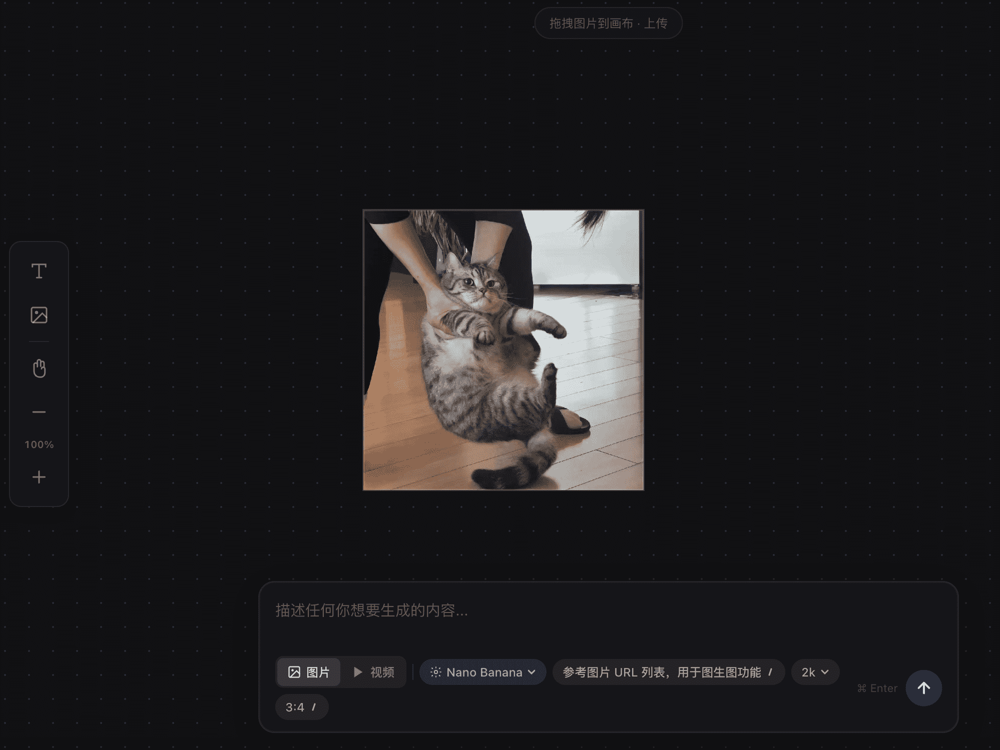

# Muse AI Studio

AI-powered creative studio for generating fashion outfits, canvas art, and multimedia content.

> **当前状态**:
> - 后端: 多厂商 AI 提供商封装完成
> - 前端: 无限画布 MVP 已实现（React + Fabric.js）

### 画布页面预览



## Project Structure

```
muse_studio/
├── .env                          # API Keys、配置
├── .env.example                  # 配置示例文件
├── .gitignore                    # Git 忽略规则
├── README.md                     # 项目说明文档
├── requirements.txt              # Python 依赖
├── package.json                  # 前端依赖（根目录统一管理）
├── pnpm-lock.yaml                # 前端依赖锁文件
├── docs/                         # 文档目录
│   ├── PRD/                      # 产品需求文档
│   └── AI_PRD/                   # AI 实现指南
│       ├── architecture.md       # 架构设计文档
│       └── provider_sop.md       # 模型/供应商添加标准操作流程
├── logs/                         # 日志输出目录
├── scripts/                      # 项目运行与运维脚本
│   ├── setup.sh                  # 初始化环境脚本
│   ├── test.sh                   # 运行测试脚本
│   └── restart.sh                # 服务重启脚本（前端+后端）
├── src/                          # 源代码主目录
│   ├── backend/                  # 后端代码（Python/FastAPI）
│   │   ├── main.py               # FastAPI 入口
│   │   ├── config.py             # 配置管理（读取 .env）
│   │   ├── database.py           # 数据库连接
│   │   ├── models.py             # ORM 模型
│   │   ├── schemas.py            # Pydantic Schema
│   │   ├── logger.py             # 日志配置
│   │   ├── utils.py              # 工具函数
│   │   ├── services/             # 核心业务逻辑
│   │   │   ├── provider_service.py  # Provider 服务层封装
│   │   │   ├── generation.py     # AI 生成调度服务
│   │   │   ├── outfit.py         # Outfit 相关服务
│   │   │   ├── canvas.py         # Canvas 相关服务
│   │   │   ├── design.py         # Design 相关服务
│   │   │   ├── feed.py           # Feed 相关服务
│   │   │   ├── asset.py          # Asset 相关服务
│   │   │   └── interaction.py    # Interaction 相关服务
│   │   ├── api/                  # API 路由层
│   │   │   ├── __init__.py       # 模块导出
│   │   │   ├── router.py         # API 路由定义
│   │   │   └── test_router.py    # API 路由测试
│   │   └── providers/            # 外部 API 封装层
│   │       ├── param_spec.py     # 参数元数据定义（ParamSpec 数据类）
│   │       ├── llm/              # LLM 提供商
│   │       │   ├── __init__.py   # 模块导出
│   │       │   ├── base.py       # BaseLLMProvider 抽象基类
│   │       │   ├── zhipu.py      # 智谱 AI 实现
│   │       │   ├── gemini.py     # Google Gemini 实现
│   │       │   └── thirtytwo.py  # 302.AI 模型聚合平台实现
│   │       ├── image/            # 图像生成提供商
│   │       │   ├── __init__.py   # 模块导出
│   │       │   ├── base.py       # BaseImageProvider 抽象基类
│   │       │   ├── thirtytwo_nano_banana.py  # 302.AI Nano Banana 模型
│   │       │   └── thirtytwo_seedream.py     # 302.AI Seedream 模型
│   │       └── video/            # 视频生成提供商
│   │           ├── __init__.py   # 模块导出
│   │           ├── base.py       # BaseVideoProvider 抽象基类
│   │           └── thirtytwo_kling.py  # 302.AI Kling 视频生成实现
│   └── frontend/                 # 前端代码（React/TypeScript）
│       ├── index.html            # HTML 入口
│       ├── vite.config.ts        # Vite 配置
│       ├── tsconfig.json         # TypeScript 配置
│       └── src/                  # 前端源码
│           ├── main.tsx          # React 入口
│           ├── App.tsx           # 应用根组件
│           ├── App.css           # 全局样式
│           ├── types.ts          # 类型定义 + 常量
│           ├── store.ts          # Zustand 状态管理
│           ├── pages/            # 页面组件
│           │   ├── Home.tsx      # 首页
│           │   └── Canvas.tsx    # 画布页面
│           ├── components/       # 通用组件
│           │   ├── CanvasEditor.tsx    # 画布编辑器入口
│           │   └── canvas/             # 画布相关组件
│           │       ├── InfiniteCanvas.tsx  # 无限画布核心组件
│           │       ├── InfiniteCanvas.css  # 画布样式（深色主题 + 点阵网格）
│           │       ├── BottomPromptBar.tsx # 底部生成面板（图片/视频 + 厂商 + 参数 chips）
│           │       └── BottomPromptBar.css # 底部面板样式（毛玻璃风格）
│           └── hooks/            # 自定义 Hooks
│               └── useFabricCanvas.ts  # Fabric.js 封装
└── tests/                        # 测试目录
    ├── conftest.py               # Pytest 配置
    ├── api/                      # API 测试
    │   └── test_router.py        # API 路由测试
    ├── services/                 # 服务层测试
    │   └── test_provider_service.py  # Provider 服务层测试
    └── providers/                # Provider 单元测试
        ├── test_param_spec.py    # 参数元数据测试
        ├── llm/                  # LLM 提供商测试
        │   ├── test_zhipu.py     # 智谱 AI 测试
        │   ├── test_gemini.py    # Gemini 测试
        │   └── test_thirtytwo.py # 302.AI 测试
        ├── image/                # 图像提供商测试
        │   ├── test_thirtytwo_nano_banana.py  # Nano Banana 测试
        │   └── test_thirtytwo_seedream.py     # Seedream 测试
        └── video/                # 视频提供商测试
            └── test_thirtytwo_kling.py  # Kling 视频测试
```

---

## 已实现的厂商

### LLM 提供商

| 厂商 | 类名 | 状态 | 暴露参数 | 推荐模型 |
|------|------|------|----------|----------|
| 智谱 AI | `ZhipuProvider` | ✅ | `thinking_enabled` | `glm-4.7-flash` |
| Google Gemini | `GeminiProvider` | ✅ | `thinking_level` | `gemini-2.5-flash` |
| 302.AI | `ThirtyTwoProvider` | ✅ | 无 | `gemini-2.5-flash` |

### 图像生成提供商

| 厂商 | 类名 | 状态 | 暴露参数 | 推荐模型 |
|------|------|------|----------|----------|
| 302.AI Nano Banana | `ThirtyTwoNanoBananaProvider` | ✅ | `images`, `resolution`, `aspect_ratio` | `google/nano-banana-2` |
| 302.AI Seedream | `ThirtyTwoSeedreamProvider` | ✅ | `image`, `aspect_ratio` | `doubao-seedream-5-0-260128` |

### 视频生成提供商

| 厂商 | 类名 | 状态 | 暴露参数 | 推荐模型 |
|------|------|------|----------|----------|
| 302.AI Kling | `ThirtyTwoKlingProvider` | ✅ | `images`, `model_name`, `mode`, `aspect_ratio`, `duration` | `kling-v2-5-turbo` |

---

## 后端 API 服务

### 架构分层

```
┌─────────────────────────────────────────────────────────┐
│                    FastAPI Routes                        │
│         /api/v1/{llm,image,video}              │
└──────────────────────┬──────────────────────────────────┘
                       │
┌──────────────────────▼──────────────────────────────────┐
│              Provider Service Layer                      │
│    ProviderRegistry | LLMService | ImageService | ...    │
└──────────────────────┬──────────────────────────────────┘
                       │
┌──────────────────────▼──────────────────────────────────┐
│                  Provider Abstract Layer                 │
│     BaseLLMProvider | BaseImageProvider | ...           │
└──────────────────────┬──────────────────────────────────┘
                       │
┌──────────────────────▼──────────────────────────────────┐
│                 External AI Services                     │
│      Zhipu | Gemini | 302.AI | Kling | ...              │
└─────────────────────────────────────────────────────────┘
```

### API 端点

#### LLM 服务

| 方法 | 端点 | 描述 |
|------|------|------|
| POST | `/api/v1/llm/generate` | 生成文本 |
| GET | `/api/v1/llm/providers` | 获取所有 LLM Provider |

**LLM 暴露参数：**

| 厂商 | 暴露参数 |
|------|----------|
| zhipu | `thinking_enabled` (bool) |
| gemini | `thinking_level` (str, choices: minimal/low/medium/high) |
| thirtytwo | 无暴露参数 |

**请求示例：**
```json
POST /api/v1/llm/generate
{
  "vendor": "zhipu",
  "prompt": "请写一首关于春天的诗",
  "parameters": {
    "thinking_enabled": true
  }
}
```

#### Image 服务

| 方法 | 端点 | 描述 |
|------|------|------|
| POST | `/api/v1/image/generate` | 生成图片 |
| GET | `/api/v1/image/providers` | 获取所有 Image Provider |

**Image 暴露参数：**

| 厂商 | 暴露参数 |
|------|----------|
| thirtytwo_nano_banana | `images` (list), `resolution` (1k/2k/4k), `aspect_ratio` (str) |
| thirtytwo_seedream | `image` (str\|list[str]), `aspect_ratio` (1:1/4:3/3:4/16:9/9:16/3:2/2:3/21:9) |

**请求示例：**
```json
POST /api/v1/image/generate
{
  "vendor": "thirtytwo_nano_banana",
  "prompt": "一只可爱的橘猫",
  "parameters": {
    "resolution": "2k",
    "aspect_ratio": "16:9"
  }
}
```

#### Video 服务

| 方法 | 端点 | 描述 |
|------|------|------|
| POST | `/api/v1/video/generate` | 生成视频 |
| GET | `/api/v1/video/providers` | 获取所有 Video Provider |

**Video 暴露参数：**

| 厂商 | 暴露参数 |
|------|----------|
| thirtytwo_kling | `images` (str\|list[str]), `model_name` (str), `mode` (std/pro), `aspect_ratio` (16:9/9:16/1:1), `duration` (5/10) |

**请求示例：**
```json
POST /api/v1/video/generate
{
  "vendor": "thirtytwo_kling",
  "prompt": "让画面中的云朵缓缓移动",
  "parameters": {
    "aspect_ratio": "16:9",
    "duration": 5
  }
}
```

#### 统一端点

| 方法 | 端点 | 描述 |
|------|------|------|
| GET | `/api/v1/providers` | 获取所有 Provider（含暴露参数） |
| GET | `/health` | 健康检查 |

**获取暴露参数示例：**
```bash
GET /api/v1/providers

# 响应包含 info.exposed_params 字段，列出该 Provider 允许通过 API 传入的参数
```

### 启动服务

```bash
# 使用 restart.sh 脚本同时启动前端和后端
./scripts/restart.sh

# 仅启动后端
./scripts/restart.sh backend

# 仅启动前端
./scripts/restart.sh frontend

# 或手动启动后端
source .venv/bin/activate
uvicorn src.backend.main:app --reload --port 8000

# 访问 API 文档
open http://localhost:8000/docs
```

---

## 前端功能

### 无限画布（深色节点编辑器风格）

**UI 风格**：深色背景（`#111113`）+ 动态点阵网格，毛玻璃面板

- **左侧工具栏**: 文字、上传图片、平移（手型图标）、缩放 +/-
- **底部生成面板**: 图片/视频模式切换、厂商选择、参数 chips、⌘+Enter 快捷生成
- **图片边框**: 上传/生成的图片带半透明白色边框，最大 280px，无旋转/缩放控制手柄
- **平移模式**: 空格键或侧边栏按钮切换
- **缩放**: 鼠标滚轮缩放（以鼠标位置为中心）
- **元素操作**: 选择、拖拽、删除（Delete/Backspace）
- **文字编辑**: 双击文字进入编辑模式
- **图片上传**: 侧边栏按钮或拖拽到画布
- **AI 生成**: 后端暴露参数自动渲染为 chips（下拉/开关/输入框），支持多厂商切换

### 技术栈

| 技术 | 版本 | 用途 |
|------|------|------|
| React | 18.3+ | UI 框架 |
| TypeScript | 5.7+ | 类型安全 |
| Vite | 6.0+ | 构建工具 |
| Fabric.js | 6.4+ | 画布渲染引擎 |
| Zustand | 5.0+ | 状态管理 |
| React Router | 7.13+ | 路由管理 |

---

## 快速开始

### 1. 环境构建

```bash
./scripts/setup.sh    # 创建虚拟环境并安装依赖
```

### 2. 配置环境变量

```bash
cp .env.example .env
# 编辑 .env 文件，填入对应厂商的 API Keys
```

### 3. 运行测试

```bash
# 运行核心测试（不含外部 API 调用）
./scripts/test.sh tests/services/test_provider_service.py  # 服务层测试
./scripts/test.sh tests/api/test_router.py                   # API 路由测试
./scripts/test.sh tests/providers/test_param_spec.py        # 参数规范测试

# 运行指定类型测试（需要配置 API Key）
./scripts/test.sh tests/providers/llm/               # LLM 提供商测试
./scripts/test.sh tests/providers/image/             # 图像提供商测试
./scripts/test.sh tests/providers/video/             # 视频提供商测试
```

### 4. 启动服务

```bash
# 启动前端 + 后端
./scripts/restart.sh

# 仅启动后端
./scripts/restart.sh backend

# 仅启动前端
./scripts/restart.sh frontend
```

访问地址:
- API 文档: http://localhost:8000/docs
- 首页: http://localhost:5173/
- 画布页: http://localhost:5173/canvas

### 5. 构建前端

```bash
pnpm run build          # 构建生产版本
pnpm run preview        # 预览生产构建
```

---

## 开发规范

### 添加新供应商

添加新的 AI 模型/供应商请遵循 `docs/AI_PRD/provider_sop.md` 中的标准流程：

1. 创建 Provider 文件：`src/backend/providers/<type>/<vendor>.py`
2. 更新模块导出：`__init__.py`
3. 添加配置项：`config.py` + `.env.example`
4. 定义参数元数据：`GENERATE_PARAMS` 类属性（使用 `ParamSpec`）
5. 创建测试：`tests/providers/<type>/test_<vendor>.py`
6. 运行测试验证：`./scripts/test.sh`

### 参数元数据系统

每个 Provider 通过 `GENERATE_PARAMS` 定义参数规范：

```python
from ..param_spec import ParamSpec

class CustomProvider(BaseLLMProvider):
    GENERATE_PARAMS = (
        ParamSpec(
            name="temperature",
            type=float,
            exposed=True,          # 是否对外暴露（API 可传入）
            default=1.0,
            description="控制输出的随机性",
            choices=None,
            required=False,
        ),
        # ...
    )
```

**参数过滤机制：**
- 只有 `exposed=True` 的参数才能通过 API 传入
- 服务层会自动过滤未暴露的参数
- 前端可通过 `/api/v1/providers` 获取暴露参数列表

获取对外暴露的参数：
```python
exposed_params = CustomProvider.get_exposed_params()
provider_info = CustomProvider.get_provider_info()
```

### 通用规范

- **代码风格**: 遵循 PEP 8
- **提交规范**: 使用 Conventional Commits（feat/fix/refactor/docs/test）
- **测试覆盖**: 新增代码必须添加测试，核心路径 80%+ 覆盖率
- **日志输出**: 所有日志输出到 `logs/` 目录
- **前端架构**: 扁平化优先，避免过度抽象，使用相对导入
- **文档**: 代码变更同步更新 README

## License

MIT
